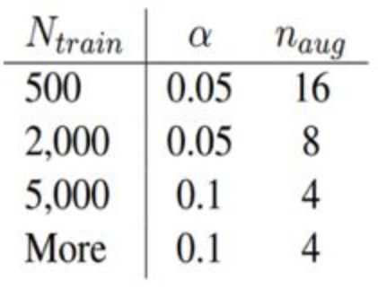

## EDA 数据增强
原文地址：[Eda: Easy data augmentation techniques for boosting performance on text classification tasks.](https://arxiv.org/abs/1901.11196)  
Code参考：[Github](https://github.com/iezhuozhuo/codeplay/blob/master/code_util/data_aug/eda.py)  
经验值：  
  
